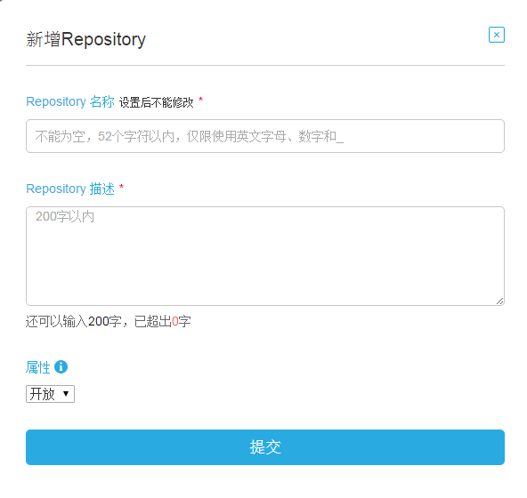
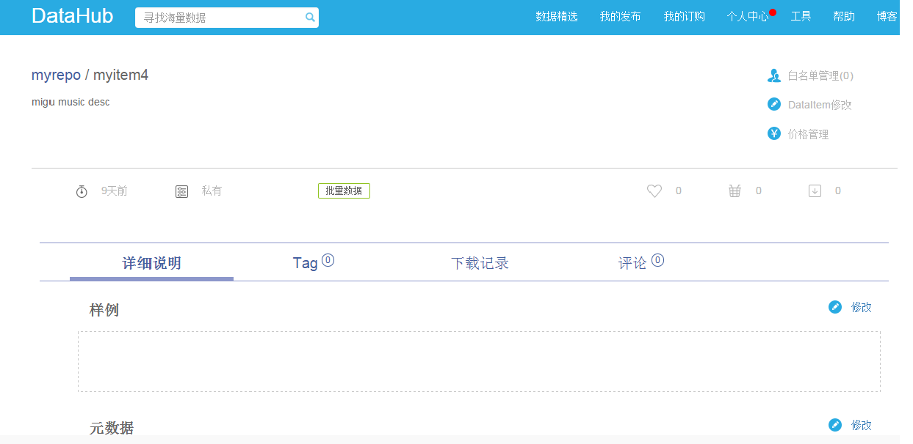
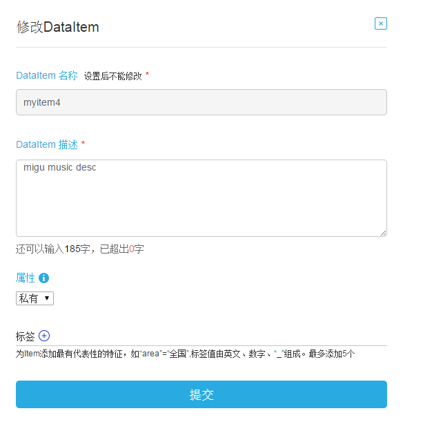
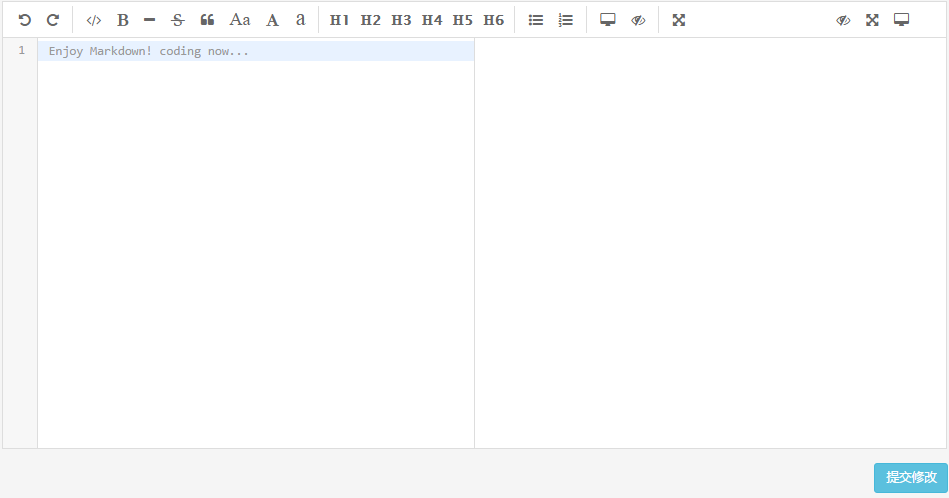

##发布数据

 
 

发布数据是数据提供方的行为，需要在网页端和 Client 客户端分步操作。在网页端您可以完成：新增私有\开放 Repository 、修改私有\开放 Repository 、修改私有\开放 DataItem ，而新增私有\开放 DataItem 、新增 Tag 等则需要通过客户端( Client )来完成。

###第一步：新增 Repository （网页端操作）

1)如果您是认证用户，登录之后，您可以开始发布数据了。进入 DataHub 网站（ hub.dataos.io ）“我的发布”，或者直接输入网址：[https://hub.dataos.io/my/publish](https://hub.dataos.io/my/publish)。

2)在“我的发布”页面，选择开放或私有 Repository （新建私有 Repository 需要会员级别是钻石会员或金卡会员）。

3)在弹出的“新增 Repository ”的设置页面，填写 Repository 的名称、描述和属性。

4)填写信息提交后，我的发布页面将出现新的 Repository 信息。

###第二步：新增 DataItem （ Client 客户端操作）

假设在 `/home/myusr/data/topub` 目录下存在若干文件，我们要发布这个目录里面的数据。

#####创建 Datapool

数据提供方使用 Client 客户端发布 DataItem 前，需要在本地基于已有数据建立一个 Datapool ，发布这个 Datapool 里面的数据。

	datahub dp create mydp file:///home/myusr/data

以上命令创建了一个名为 mydp 的 Datapool ，类型是 file ，路径是 /home/myusr/data 。

如果成功，会显示：
 
	Datapool has been created successfully. 	Name:mydp type:file path:/home/myusr/data.

####新增 DataItem

发布 DataItem 需要指定 `$DATAPOOL` 和 `$DATAPOOL` 下的子路径 `$LOCATION` 。可选参数item属性（ accesstype ），可选为public或者 private, 默认 private；可选参数item描述（ comment ）；可选参数数据类型（ supplystyle ），可为流式（ flow ）、 api 、批量（ batch ）中的一种，默认为批量。

	datahub pub myrepo/myitem mydp://topub --accesstype=public --comment="my test item" --supplystyle=batch
    
以上命令发布了一个名称为 myitem 的 DataItem ，所属 Repository 是 myrepo ，对应 mydp 的子目录 topub ，即待发布数据存在于 `/home/myusr/data/topub` 中。

如果成功，会显示：

	DataHub : Successed in publishing.

####补充 DataItem 信息

您可以选择在网页端或 Client 客户端对 DataItem 的信息进行补充。

- ######在网页端补充 DataItem 信息

    - 选择 DataItem 修改，或样例、元数据修改。

    

	- 修改 DataItem 页面：

	

	- 修改样例或元数据页面：

	

- ######在 Client 客户端补充 DataItem 信息

	在发布 DataItem 之前，可以在其对应的目录里创建、编译三个文件： sample.md 、 eta.md 、price.cfg ，这三个文件的作用分别是：

 - sample.md 用于保存 Markdown 格式的样例数据，如果没有此文件，程序会读取此目录下的第一个 tag 文件的前十行，作为样例数据，发布到 item 的详情里。

 - meta.md 用于保存 Markdown 格式的元数据。

 - price.cfg 用于保存 JSON 格式的资费计划，用来明确此 DataItem 的资费。

格式如下：

    {
    	"price":[
    				{
                    	"times":10,
                        "money": 5,
                        "expire":30
                    },
                    {
                    	"times": 100,
                        "money": 45,
                        "expire":30
                    },
                    {
                    	"times":500,
                        "money": 400,
                        "expire":30
                    }
                ]
    }

其中 times 代表可 pull 次数， money 代表价格， expire 代表有效期。

###第三步：新增 tag（ Client 客户端操作）

发布 tag 必须指定 TAGDETAIL ,用来指定 tag 对应文件名，该文件必须存在于 $DATAPOOL://$LOCATION 内，可选参数 tag 描述 （ comment ）。

	datahub pub myrepo/myitem:mytag test.txt

以上命令发布了一个名称为 mytag 的 tag，所属 DataItem 是 myitem，对应的数据文件是 `/home/myusr/data/topub/test.txt`。

如果成功，会显示：

	DataHub : Successed in publishing.

####备注  
* [pub命令详细介绍](pub.md)  
* [发布数据样例场景](example2.md)

*  Markdown 格式的语法，可参见 [http://www.markdown.cn/](http://www.markdown.cn/) 。

* 资费计划说明。价格属性包括免费、付费、限量试用。不填价格默认数据免费，每个 DataItem 最多可录入 6 种价格。若为批量、 API 数据，则为 xx 元 = 50 次 ， xx 天有效期，若为流式数据，则为 xx 元 = xx 天， xx 天有效。
